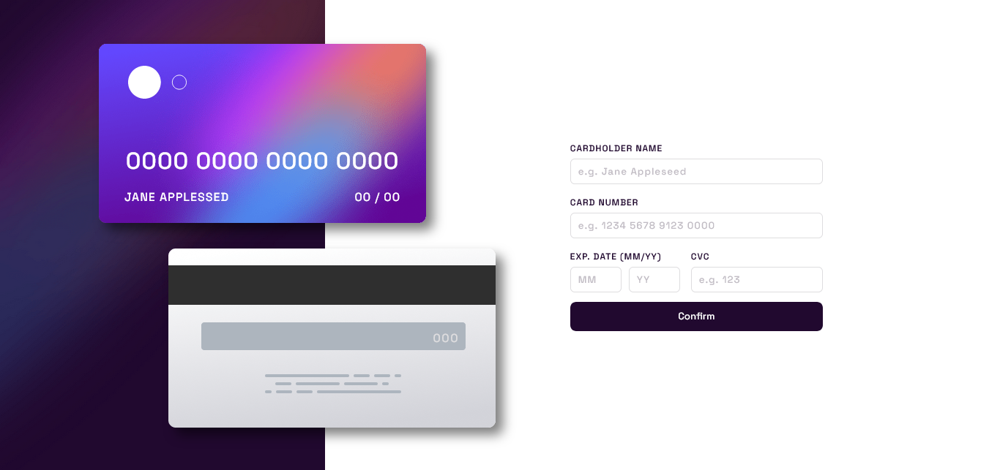
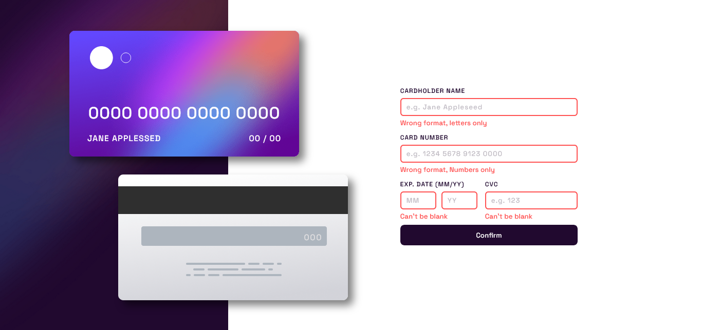

## Pt-Br
------------------------------------------------------------------------------------------------------------------------------------------------ 
# Frontend Mentor - Formulário de Detalhes do Cartão Interativo
Esta é uma solução para o [Formulário de Detalhes do Cartão Interativo](https://www.frontendmentor.io/challenges/interactive-card-details-form-XpS8cKZDWw).


## Índice

- [Visão Geral](#visão-geral)
    -[Captura de Tela](#captura-de-tela)
- [Meu processo](#meu-processo)
    -[Construído com](#construído-com)
    -[O que aprendi](#o-que-aprendi)
    -[Desenvolvimento Contínuo](#desenvolvimento-contínuo)
- [Autor](#autor)
- [Agradecimentos](#agradecimentos)

------------------------------------------------------------------------------------------------------------------------------------------------

## Visão Geral
### O desafio
Seus usuários devem ser capazes de:

* Preencha o formulário e veja a atualização dos dados do cartão em tempo real;
* Receba mensagens de erro quando o formulário for enviado se:
    * Qualquer campo de entrada está vazio;
    * O número do cartão, a data de validade ou os campos CVC estão no formato errado.
* Visualize o layout ideal dependendo do tamanho da tela do dispositivo;
* Veja os estados de focalização, ativo e foco para elementos interativos na página.

### Captura de tela



### Links 
* URL da solução: [Frontend Mentor](https://www.frontendmentor.io/challenges/interactive-card-details-form-XpS8cKZDWw/hub).
* URL do site: [Interactive Card Details Form]() 

------------------------------------------------------------------------------------------------------------------------------------------------

## Meu Processo 
### Construído com 
- HTML 
- CSS
- JavaScript

### O que aprendi 
Com esse desafio pude por em prática o que venho estudando com javascript e descobri onde preciso melhorar. Ainda não tinha utilizado o QuerySelector em um projeto, então foi bastante gratificante utilizá-lo aqui. Aprendi também a setar os valores que um input irá receber sem precisar defini-lo no HTML

```
const frontCardName = document.getElementById('front_name');
const inputName = document.querySelector('#inputName');
const erroName = document.querySelector('#erro_card_name');
```
* Utilização do QuerySelector para recuperar o nome do usuário

```
function setCardNumber(e) {
    frontCardNumber.innerText = format(e.target.value);

    let key = e.key;
    let keyNumbers = key.match(/^[0-9 ]*$/);

    if (inputNumber.value === '') {
        frontCardNumber.innerText = "0000 0000 0000 0000"
    } else if (keyNumbers) {
        frontCardNumber.innerText = inputNumber.value;
        erroNumber.style.display ='none';
        inputNumber.classList.remove('inputErro');
    } else if (key === "Backspace") {
        inputNumber.setAttribute("enabled", "")
    } else {
        erroNumber.style.display = 'flex';
        inputNumber.classList.add('inputErro');
        inputNumber.blur();
    }

}
```
* Função para setar os valores que o input numérico irá receber, além de retornar um erro se o usuário informar uma tecla que não seja numérica.

------------------------------------------------------------------------------------------------------------------------------------------------

## Autor 
- Frontend Mentor [@StenioVenancius](frontendmentor.io/profile/StenioVenancius)
- Twitter [@veennix](https://twitter.com/veennix)

------------------------------------------------------------------------------------------------------------------------------------------------

## Agradecimentos 
Muito Obrigado por ter lido até aqui ❣️
Sinta-se avontade para enviar seu feedback!

------------------------------------------------------------------------------------------------------------------------------------------------
------------------------------------------------------------------------------------------------------------------------------------------------
## EN
------------------------------------------------------------------------------------------------------------------------------------------------

# Frontend Mentor - Interactive Card Details Form
This is a solution to the [Interactive Card Details Form](https://www.frontendmentor.io/challenges/interactive-card-details-form-XpS8cKZDWw).
------------------------------------------------------------------------------------------------------------------------------------------------

## Table of contents
- [Overview](#Overview)
    -[Screenshot](#screenshot)
- [My process](#my-process)
    -[Built with](#built-with)
    -[What I Learned](#What-I-Learned)
    -[Continuous-Development](#Continuous-Development)
- [Author](#author)
- [Acknowledgments](#acknowledgments)

------------------------------------------------------------------------------------------------------------------------------------------------

## Overview
### Challenge
Your users should be able to:

* Fill in the form and see the card details update in real-time;
* Recive error messages when the form is submitted if:
    * Any input field is empty;
    * The card number, expiry date, or CVC fields are in the wrong format.
* View the optimal layout depending on their device's screen size; 
* See hover, active, and focus states for interactive elements on the page.

### Print Screen


### Links 
* Solution URL: [Frontend Mentor](https://www.frontendmentor.io/challenges/interactive-card-details-form-XpS8cKZDWw/hub).
* Live Site URL: [Interactive Card Details Form]() 

------------------------------------------------------------------------------------------------------------------------------------------------

## My Process
### Built with
- HTML
- CSS
- JavaScritpt

### What I learned
With this challenge I was able to put into practice what I've been studying with javascript and I found out where I need to improve. I hadn't used the QuerySelector in a project yet, so it was quite satisfying to use it here. I also learned how to set the values that an input will receive without having to define it in the HTML.

```
const frontCardName = document.getElementById('front_name');
const inputName = document.querySelector('#inputName');
const erroName = document.querySelector('#erro_card_name');
```
* Using the QuerySelector to retrieve the username

```
function setCardNumber(e) {
    frontCardNumber.innerText = format(e.target.value);

    let key = e.key;
    let keyNumbers = key.match(/^[0-9 ]*$/);

    if (inputNumber.value === '') {
        frontCardNumber.innerText = "0000 0000 0000 0000"
    } else if (keyNumbers) {
        frontCardNumber.innerText = inputNumber.value;
        erroNumber.style.display ='none';
        inputNumber.classList.remove('inputErro');
    } else if (key === "Backspace") {
        inputNumber.setAttribute("enabled", "")
    } else {
        erroNumber.style.display = 'flex';
        inputNumber.classList.add('inputErro');
        inputNumber.blur();
    }

}
```
* Function to set the values that the numerical input will receive, in addition to returning an error if the user enters a key that is not numeric.

------------------------------------------------------------------------------------------------------------------------------------------------

## Author
- Frontend Mentor [@StenioVenancius](frontendmentor.io/profile/StenioVenancius)
- Twitter [@veennix](https://twitter.com/veennix)

------------------------------------------------------------------------------------------------------------------------------------------------

## Acknowledgments
Thank you so much for reading this far ❣️
Feel free to submit your feedback!

------------------------------------------------------------------------------------------------------------------------------------------------
